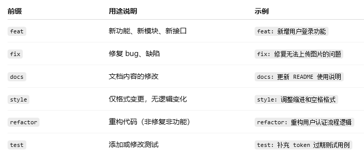
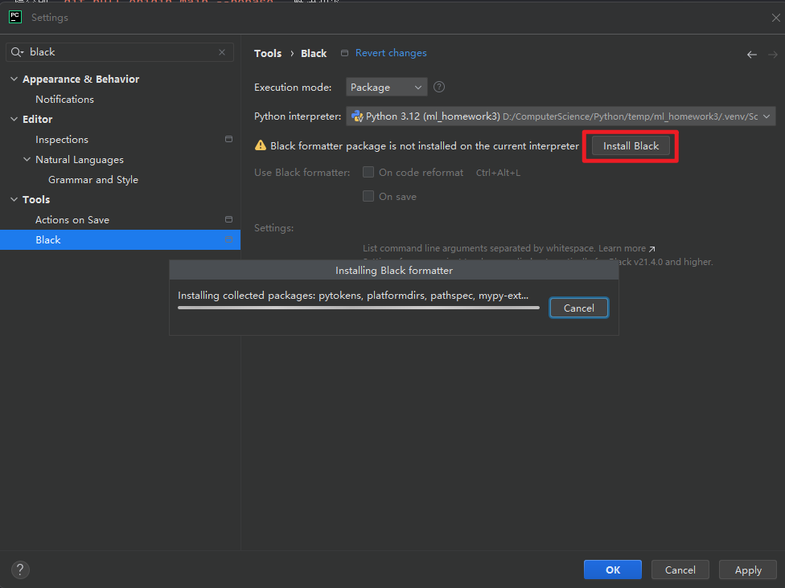

# 开发参考手册

## 目录结构

```
project-root/
├── README.md
├── .gitignore
├── .env.example          # 提交到仓库
├── .env                  # 只在本地，实际被 .gitignore 忽略
├── requirements.txt
├── package.json
│
├── data/                 # 数据集
│   └── .gitkeep
│
├── models/               # 本地模型
│   ├── .gitkeep
│   ├── embeddings/
│   │   └── .gitkeep
│   ├── sentiment/
│   │   └── .gitkeep
│   └── clustering/
│       └── .gitkeep
│
├── src/                  # 模型源代码
│   ├── __init__.py
│   ├── config/           # 通用配置
│   │   └── settings.py
│   ├── common/           # 通用工具
│   │   └── logging_utils.py
│   ├── embeddings/       # 嵌入编码
│   ├── sentiment/        # 情感分析
│   └── clustering/       # 聚类标签
│
├── web/                   # 对外接口
│   ├── backend/            # 后端
│   │   ├── main.py
│   │   └── routers.py
│   └── frontend/           # 前端
│
├── tests/                # 测试代码
└── docs/                 # 其他文档
```

## 规范

### 一、分支与提交流程

* 分支策略

    * `main`：稳定分支，只接收 PR，禁止直接 push。
    * 功能分支：`feature/embeddings-*`、`feature/sentiment-*`、`feature/clustering-*`、`feature/web-*`。
    * 每次一个功能一定新开一个分支，而不要长期使用一个个人分支
    * 约定分支格式：
      ```
      feature/<模块>-<内容>-<姓名缩写>
      fix/<模块>-<问题>-<姓名缩写>
      
      eg. feature/clustering-init-wzw
      ```

* 提交流程

    1. 本地开发 → 自测通过
    2. 提交前 `git pull origin main --rebase`，解决冲突
    3. 发 PR，至少 1 人简单 review 后再合并

* Commit message 建议风格：

    * `feat: add sentiment predictor`
    * `fix: handle empty text in clustering pipeline`
    * 具体内容参照表格

---

### 二、代码风格（后端 / 算法）

* Python

    * 遵守 PEP8，变量命名统一用小写+下划线：`sentence_vectors`。
    * 函数和公共接口加类型注解：

      ```python
      import numpy as np
      def get_sentence_embeddings(texts: list[str]) -> np.ndarray:
          ...
      ```
    * 核心模块建议使用自动格式化：

        * `black`格式化工具
          

* 日志

    * 全部使用 `src/common/logging_utils.py` 封装的 logger，不在代码里随便 `print`。
    * 重要事件：请求入口、模型加载、聚类失败、外部 API 调用异常等必须打日志。

---

### 三、配置与环境变量

* `.env` 只在本地存在，不提交；模板写在 `.env.example`：
    * 如：`API_KEY=...`、`MODEL_DIR=...`、`DATA_DIR=...`。
* 所有路径、Key 等统一通过 `src/config/settings.py` 读取，禁止在模块里硬编码。
* 新增环境变量时：
    1. 更新 `.env.example`
    2. 更新 `settings.py`

---

### 四、数据与模型管理

* 严格遵守：

    * 数据文件只放在 `data/`，模型权重只放在 `models/`。
    * 不在仓库提交真实数据和大模型权重（`.gitignore` 已限制）。
* 如需提供 Demo，小样本可以放在 `data/sample/`，控制在几十 KB 级别。
* 共享方式：网盘 / 模型下载链接 + 文档说明，包含：

    * 下载地址
    * 本地应放置的路径（相对于 `project-root`）

